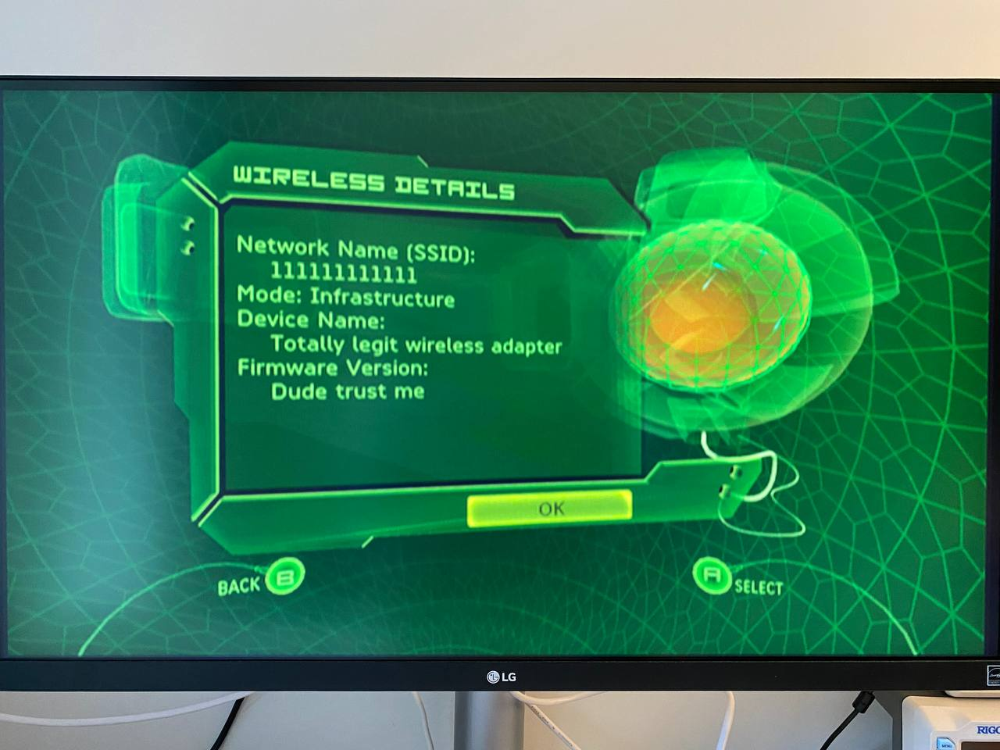

# Xbox Wireless Adapter Communication Protocol

A clean room reverse engineering project of the official `Xbox MN-740 Wireless Bridge`, specifically how it interacts with the Xbox's dashboard. The original goal was to look for a juicy buffer overflow on the Xbox side, but since there weren't any, those results can still be used for educational purposes.

## Contents

This repo currently contains the following bits:
 - A more-or-less working emulator of the wireless adapter, works both with a real Xbox and Xemu;
 - An incomplete [description](communication_protocol.md) of the communication protocol between the console and the wireless adapter;
 - Debug symbols for the `xonlinedash.xbe` version `185ead00 (MD5: 8149654a030d813bcc02a24f39fd3ce9)` in a form of Ghidra XML that I reacreated (or should I say guessed?) in the process.

## Emulator how-to

### Prerequisites:
- A Linux system. The emulator need to be able to open a raw ethernet socket which is possible out of the box in Linux. Windows and macOS may probably require some additional changes;
- A copy of **one** of the following files:
    - `xonlinedash.xbe` version `185ead00 (MD5: 8149654a030d813bcc02a24f39fd3ce9)`, **or**;
    - The MN-740 firmware `NLM.MEM` version `01.00.02.0021 (MD5: A9A58ADC4CEAEC337BAAB64F018FBA7F)`. You can obtain this file by:
        1. Downloading the `mn740Update.exe` tool;
        2. Run the executable, it will place the file `MN740_01.00.02.0021_RUNTIME.bin` file into the temp directory; 
        3. Extract the file with the WinArj or a similar extraction tool and it will extract the `NLM.MEM` file.
 
 Note: these files are copyrighted material by Microsoft and are needed for the emulator to work. Needless to say they can't be distributed, so it will be extracted from the binary provided  by the user.

### Running the emulator:

1. First of all, you need to extract some secrets from either the console or the mn-740 firmware update.
You can do this by running  
`$ python3 extract_secrets.py <path_to_file>`

2. Now you can run the emulator itself:  
`$ sudo python3 emulator.py <network_interface>`  
Superuser privileges are required for opening a raw ethernet socket.  
As for the network interface - for a real Xbox, provide the name of the network adapter connected to same network as the Xbox; for Xemu, bind both Xemu and emulator to the same network interface, `lo` works just fine for this purpose.
